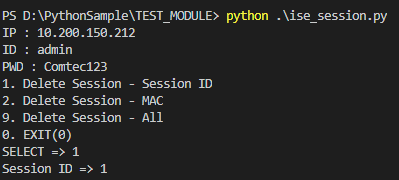
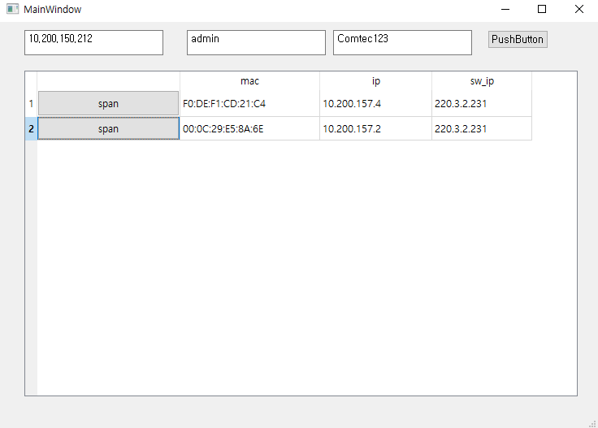

# What is this?
 - This is the session delete of CISCO ISE script.
 - you can see the active session in CISCO ISE

## Required package
	pip intall requests
	pip intall xmltodict
	pip intall PyQt5
	(you can see this : https://pypi.org/project/PyQt5/)
	and install the "Runtime Compiler C++2015)

## Used to
 this support is tow mode.
 - cli mode : only delete(session, mac, ip)
 - gui mode : any function(show session, delete session/mac/ip)

#### install
 - pip install -r requirements.txt

#### cli example
	python3 ise_session.py

	
#### gui example
	python3 ise_session_gui.py

	

## License
This project is licensed under the Apache License 2.0 - see the LICENSE.md file for details.
